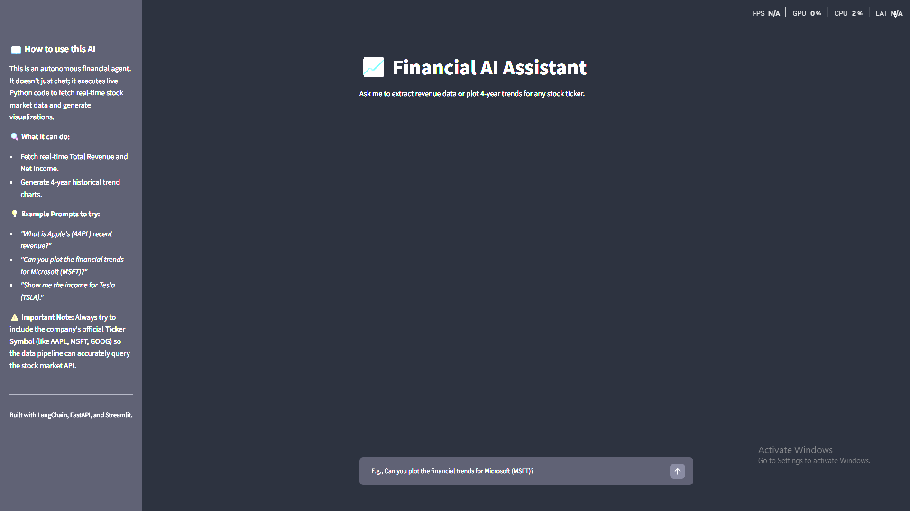
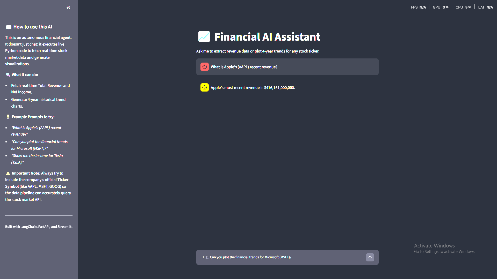
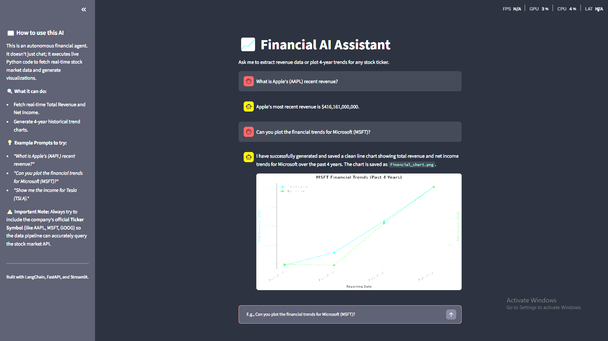
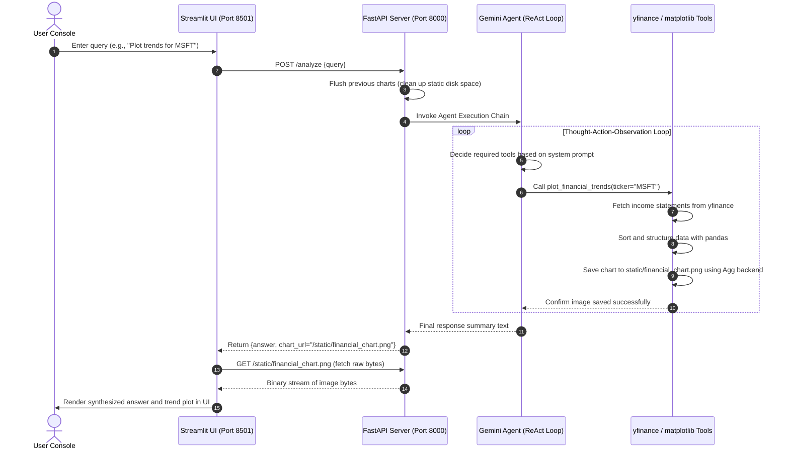

# Agentic AI Financial Analyst 📈🤖
**Live Demo:** [finai.arunjyoticode.me](https://finai.arunjyoticode.me/)

An end-to-end, enterprise-grade **Agentic AI Financial Analyst** built to extract, analyze, and visualize real-time stock market data with cognitive precision. The system features a fully decoupled microservices architecture utilizing a FastAPI REST gateway backend and an interactive Streamlit frontend client.

Powered by **Google Gemini 2.5 Flash** as the core cognitive engine, the system implements a LangGraph-inspired ReAct (Reason + Act) state machine to dynamically plan, call Python-based `yfinance`/`pandas` APIs, and synthesize professional investment insights on demand.

---

## 🖥️ System Interface

### 1. Real-Time Financial Querying


### 2. Chronological Financial Analysis


### 3. Interactive Trend Visualizations


---

## 🛠️ System Architecture & Separation of Concerns

The project is structured as a decoupled, multi-tier microservices application for high maintainability, isolated testing, and scalable deployment:

```plaintext
ai_financial_analyst/
├── backend/
│   ├── static/          # Directory containing generated matplotlib trend charts
│   ├── webapi.py        # FastAPI REST API server
│   ├── data_fetcher.py  # LangChain Agent logic & tool configurations
│   ├── requirements.txt # Backend dependencies (FastAPI, LangChain, yfinance, matplotlib, etc.)
│   └── Dockerfile       # Container definition for the backend
├── frontend/
│   ├── stapp.py         # Streamlit user interface communicating with backend
│   ├── requirements.txt # Frontend dependencies (Streamlit, requests)
│   └── Dockerfile       # Container definition for the frontend
├── scripts/
│   └── test_agent.py    # CLI testing script to verify agent behavior locally
├── docs/
│   ├── query_revenue.png
│   ├── query_trends.png
│   └── trend_chart.png
├── .env.example         # Template for environment variables
├── .gitignore           # Git ignore rules
├── docker-compose.yml   # Multi-container orchestrator configuration
└── README.md            # Master documentation
```

### Component Breakdown:
* **Streamlit Frontend Client (`frontend/stapp.py`):** Delivers a responsive user experience. It passes prompt requests to the FastAPI backend, fetches the generated matplotlib chart bytes via internal REST endpoints, and displays them dynamically in the chat window.
* **FastAPI Backend Gateway (`backend/webapi.py`):** Exposes a `/analyze` REST endpoint. For each request, it cleans up previous visualizations, invokes the cognitive loop, and routes static assets via FastAPI's `StaticFiles` mounting.
* **Cognitive Agent & Python Tool Pipeline (`backend/data_fetcher.py`):** Initializes **Google Gemini 2.5 Flash** as the reasoning core. It integrates two specialized Python-based tools:
  * `get_financial_metrics`: Queries `yfinance` to parse real-time income statements and extract key financial parameters.
  * `plot_financial_trends`: Fetches historical data, performs chronological sorting with `pandas`, and plots multi-year trends.
* **Command-Line Testing Harness (`scripts/test_agent.py`):** A standalone execution script enabling offline validation of LLM tool-calling and yfinance data extraction.

---

## 📊 Request/Response Execution Flow



---

## ⚡ Technical Highlights & Engineering Decisions

* **Decoupled Architecture over Monolith:** Separating the Streamlit UI from the FastAPI backend ensures clean horizontal scaling. The UI is completely stateless and handles presentation, while the backend focuses on computationally heavy cognitive routing and data fetching.
* **Headless Matplotlib Engine (Agg Backend):** Running data visualization in multi-threaded web application contexts frequently causes thread-safety issues, core dumps, or GUI display errors. The backend explicitly invokes `matplotlib.use("Agg")` (rasterizer for PNGs) to bypass asynchronous GUI thread locks, generating clean visual outputs in memory before saving them to disk.
* **In-Memory Chart Retrieval:** Instead of sharing folders/volumes directly between containers in production, the frontend pulls the generated chart bytes by querying the backend's static URL endpoint. This decoupled REST approach is robust, secure, and ready for serverless deployments.
* **Production-Grade Data Cleansing:** Raw stock market metrics contain missing indexes, mismatched timestamps, or reverse chronological order. The custom tools sort indices using `pandas` and clean timestamp structures into simple `YYYY-MM-DD` lists to guarantee accurate, readable time-series plots.

---

## 🚀 Setup & Execution Guide

### Prerequisite: API Key Setup
Create a `.env` file in the root directory (based on `.env.example`) and add your Google Gemini API key:
```env
GOOGLE_API_KEY=AIzaSy...
```

### Running Locally (Bare Metal)

#### 1. Setup Virtual Environment & Dependencies
Ensure you have Python 3.10+ installed.

```bash
# Create and activate virtual environment
python -m venv .venv
# On Windows (PowerShell):
.venv\Scripts\Activate.ps1
# On macOS/Linux:
source .venv/bin/activate
```

#### 2. Launch the Backend API
Navigate to the `backend/` folder, install requirements, and start the Uvicorn server:
```bash
cd backend
pip install -r requirements.txt
python webapi.py
```
*The backend API will start running at `http://localhost:8000`.*

#### 3. Launch the Streamlit Frontend
Navigate to the `frontend/` folder in a new terminal, install requirements, and run the Streamlit server:
```bash
cd frontend
pip install -r requirements.txt
streamlit run stapp.py
```
*The frontend dashboard will open in your default browser at `http://localhost:8501`.*

---

### Running via Docker Compose

Both microservices are fully containerized and can be launched together using Docker:

#### Build and Run:
```bash
docker-compose up --build
```
* Access the Streamlit user interface at `http://localhost:8501`.
* Access the FastAPI backend documentation (Swagger) at `http://localhost:8000/docs`.

---

## 🧑‍💻 CLI Sandbox Testing

If you want to test the tool execution and financial data retrieval without spawning the API server or the Streamlit client, run the standalone testing script:

```bash
python scripts/test_agent.py
```
*This script runs a test query through the Gemini 2.5 Flash agent, executes the tools, and verifies that the trend chart was generated inside `backend/static/`.*
